# Obsidian + Zotero 文献笔记工作流教程

> 适用对象：已经使用 Zotero 管理论文，希望把文献批注、摘要和自己的理解整理到 Obsidian 中。
>
> 核心目标：Zotero 负责保存原始文献和 PDF 批注，Obsidian 负责沉淀自己的理解、项目关联和长期知识库。
> 
> 个人建议：先按顺序参照整个流程走一遍，明确这个过程到底是在干什么，如果实在不会/想偷懒，可直接参考[15. 懒人快速配置](#15-懒人快速配置)

## 目录

- [1. 这套流程解决什么问题](#1-这套流程解决什么问题)
- [2. 推荐工作流](#2-推荐工作流)
- [3. 需要安装的软件和插件](#3-需要安装的软件和插件)
  - [3.1 必备软件](#31-必备软件)
  - [3.2 Zotero 推荐插件](#32-zotero-推荐插件)
  - [3.3 Obsidian 插件](#33-obsidian-插件)
- [4. Zotero 端准备](#4-zotero-端准备)
  - [4.1 文献必须有父条目](#41-文献必须有父条目)
  - [4.2 在 Zotero 阅读器里做批注](#42-在-zotero-阅读器里做批注)
  - [4.3 citation key 建议](#43-citation-key-建议)
- [5. Obsidian 端目录约定](#5-obsidian-端目录约定)
- [6. Zotero Integration 插件配置](#6-zotero-integration-插件配置)
  - [6.1 PDF Utility](#61-pdf-utility)
- [7. 文献笔记模板](#7-文献笔记模板)
- [8. 隐藏同步标记的 CSS](#8-隐藏同步标记的-css)
- [9. 日常使用流程](#9-日常使用流程)
  - [9.1 第一次导入一篇文献](#91-第一次导入一篇文献)
  - [9.2 后续更新批注](#92-后续更新批注)
  - [9.3 跳回 Zotero 原文](#93-跳回-zotero-原文)
- [10. 哪些地方可以自己写](#10-哪些地方可以自己写)
- [11. 推荐的“我的笔记”结构](#sec-11-notes-structure)
- [12. 如何用 Obsidian 提升文献工作效率](#12-如何用-obsidian-提升文献工作效率)
  - [12.1 建立概念笔记](#121-建立概念笔记)
  - [12.2 用 tag 做粗分类](#122-用-tag-做粗分类)
  - [12.3 项目笔记中引用文献笔记](#123-项目笔记中引用文献笔记)
- [13. 常见问题](#13-常见问题)
  - [Q1：为什么会看到 `%% begin research_v1 %%`？](#faq-q1)
  - [Q2：为什么 Zotero 标签在 Obsidian 中提示非法？](#faq-q2)
  - [Q3：为什么文件名连在一起？](#faq-q3)
  - [Q4：我能不能直接改文献信息表格？](#faq-q4)
  - [Q5：Zotero 新增批注后 Obsidian 会自动更新吗？](#faq-q5)
  - [Q6：PDF Utility 下载失败怎么办？](#faq-q6)
- [14. 组内推荐规范](#14-组内推荐规范)
- [15. 懒人快速配置](#15-懒人快速配置)
- [16. 笔记备份](#16-笔记备份)
  - [16.1 必须备份哪些文件](#161-必须备份哪些文件)
  - [16.2 不建议备份哪些文件](#162-不建议备份哪些文件)
  - [16.3 在 GitHub 上创建空仓库](#163-在-github-上创建空仓库)
  - [16.4 在 VS Code 中初始化仓库](#164-在-vs-code-中初始化仓库)
  - [16.5 关联 GitHub 远程仓库](#165-关联-github-远程仓库)
  - [16.6 添加 `.gitignore`](#166-添加-gitignore)
  - [16.7 提交和推送](#167-提交和推送)
  - [16.8 推荐备份习惯](#168-推荐备份习惯)
- [17. 附带配置文件](#17-附带配置文件)


---

## 1. 这套流程解决什么问题

单独使用 Zotero 时，论文、高亮、批注都保存在 Zotero 里，适合阅读和回看原文，但不太适合把不同论文、项目、概念串起来。

单独使用 Obsidian 时，适合写总结、做链接、整理项目知识，但手动复制 PDF 批注很麻烦。

这套流程把两者分工：

```text
Zotero：收文献、管 PDF、做高亮/批注、维护元数据
Obsidian：导入文献信息、汇总批注、写自己的理解、链接项目和概念
```

它不是实时同步，而是手动更新：

```text
在 Zotero 中阅读/批注
        ↓
在 Obsidian 中运行“导入/更新文献笔记”
        ↓
生成或更新 Markdown 文献笔记
```

---

## 2. 推荐工作流

```text
1. Zotero 导入论文 PDF
2. Zotero 中补全元数据，例如标题、作者、年份、DOI、期刊
3. Zotero PDF 阅读器中高亮、写批注、框图
4. Obsidian 中运行 Zotero Integration 导入命令
5. Obsidian 生成 Markdown 文献笔记
6. 在“我的笔记”区域写自己的理解、推导、疑问和项目关联
7. 后续 Zotero 有新批注时，再运行一次导入命令更新
```

一句话：

```text
Zotero 保存证据，Obsidian 生成理解。
```

---

## 3. 需要安装的软件和插件

### 3.1 必备软件

- Zotero
- Obsidian

### 3.2 Zotero 推荐插件

- Better BibTeX

Better BibTeX 用来生成稳定的 citation key。Obsidian 导出的文献笔记文件名来自 `{{citekey}}`，所以建议安装。

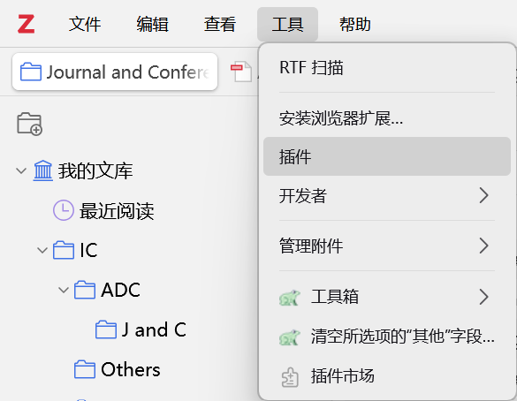
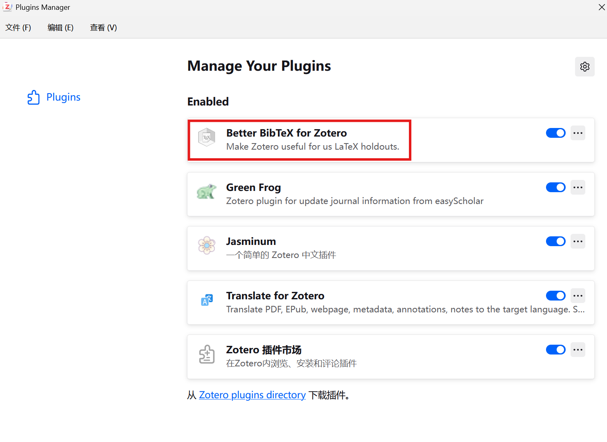

### 3.3 Obsidian 插件

- Zotero Integration

插件 ID 是：

```text
obsidian-zotero-desktop-connector
```

它负责从 Zotero 读取文献信息、PDF 批注，并按模板导出 Markdown。

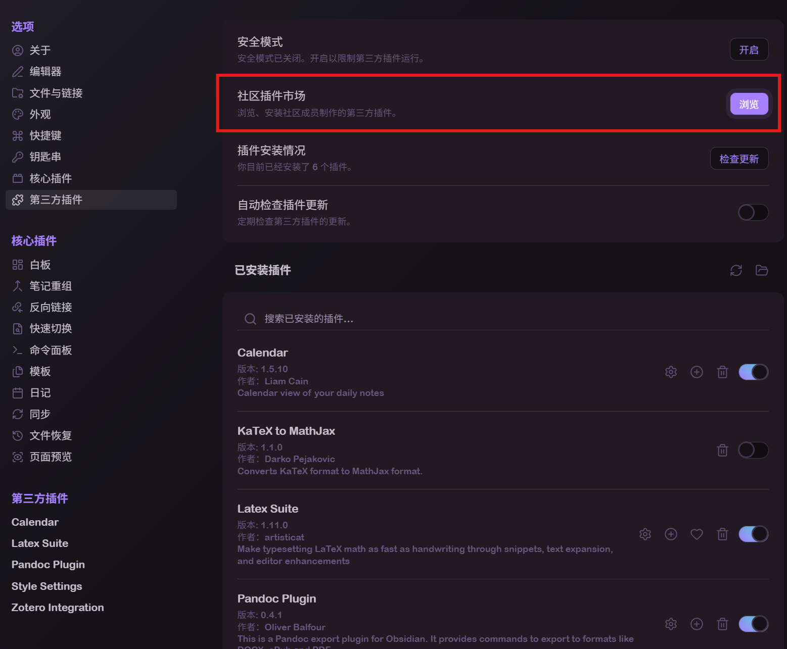
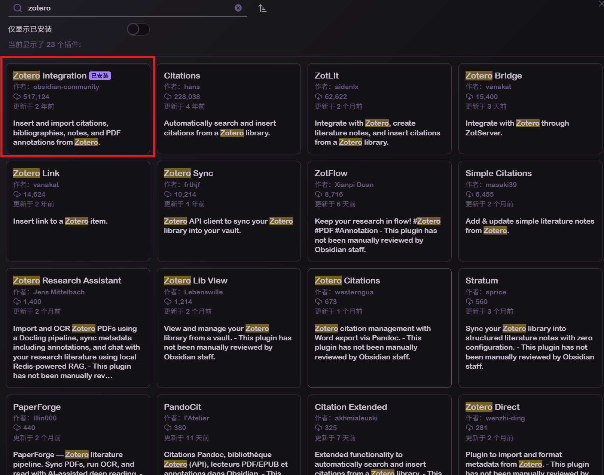

---

## 4. Zotero 端准备

### 4.1 文献必须有父条目

Zotero 中建议保持这种结构：

```text
论文父条目
  └── PDF 附件
```

不要只保存一个孤立 PDF。否则导入时可能缺少标题、作者、DOI、年份等元数据。

如果只有 PDF，可以右键 PDF，使用：

```text
从 PDF 检索元数据
```

或：

```text
Create Parent Item
```

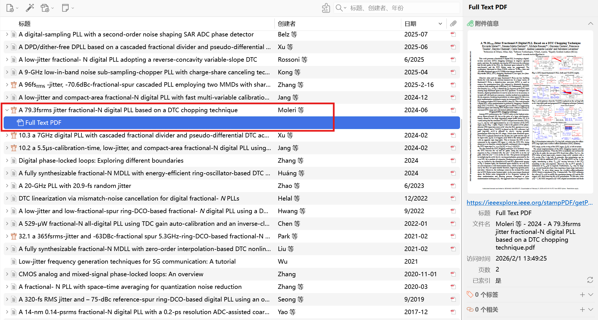

### 4.2 在 Zotero 阅读器里做批注

双击 PDF，用 Zotero 自带阅读器打开，然后进行：

- 高亮
- 文字批注
- 矩形/图片批注
- 页面标注

导入 Obsidian 时，这些内容会进入文献笔记的“批注”区域。

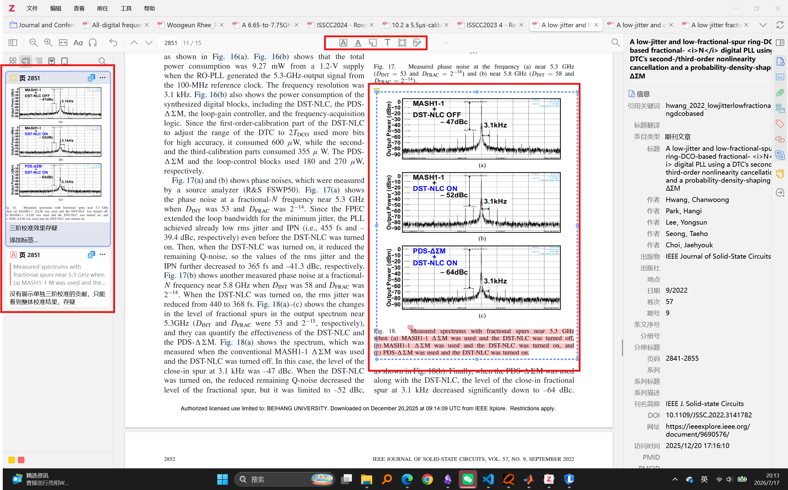

### 4.3 citation key 建议

文献笔记文件名来自 citation key，例如：

```text
hwang2022lowjitter.md
```

如果希望文件名更清楚，可以在 Better BibTeX 中设置 citation key 格式，例如带下划线：

```text
hwang_2022_low_jitter
```

大致位置：

```text
Zotero -> Settings/Preferences -> Better BibTeX -> Citation keys
```

修改后，对已有文献可以右键刷新 BibTeX key。

参考：
```
auth.lower + "_" + year + "_" + shorttitle(3,3).lower
```

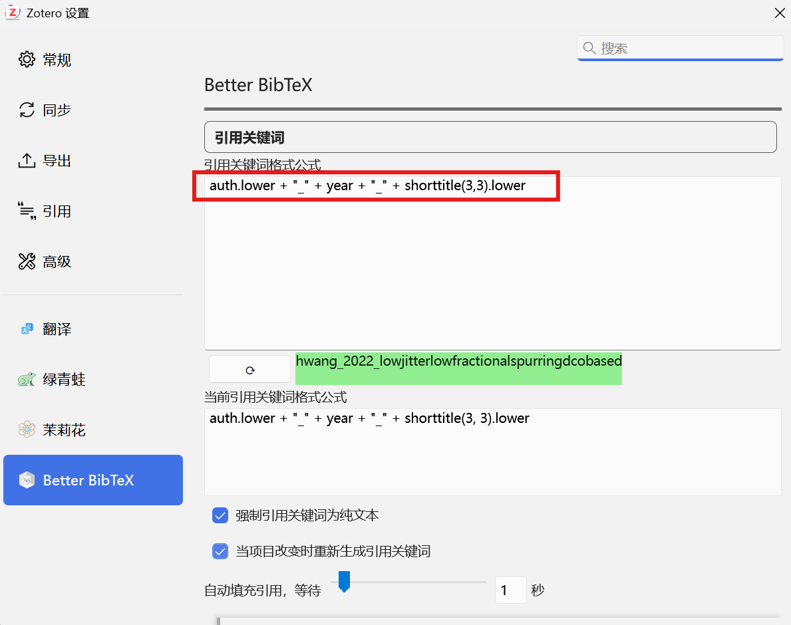

---

## 5. Obsidian 端目录约定

本教程示例使用以下目录：

```text
IC/Projects/论文阅读/Zotero_Notes/
```

文献笔记输出到：

```text
IC/Projects/论文阅读/Zotero_Notes/{{citekey}}.md
```

图片/矩形批注输出到：

```text
IC/Projects/论文阅读/Zotero_Notes/attachments/{{citekey}}/
```

模板文件放在：

```text
obsidian_template/Zotero_template.md
```

CSS snippet 放在：

```text
.obsidian/snippets/zotero-note-hide-sync-comments.css
```

---

## 6. Zotero Integration 插件配置

Zotero Integration 的配置文件在：

```text
.obsidian/plugins/obsidian-zotero-desktop-connector/data.json
```

**可以直接复制下面的配置文件**，也可以通过插件设置界面配置。

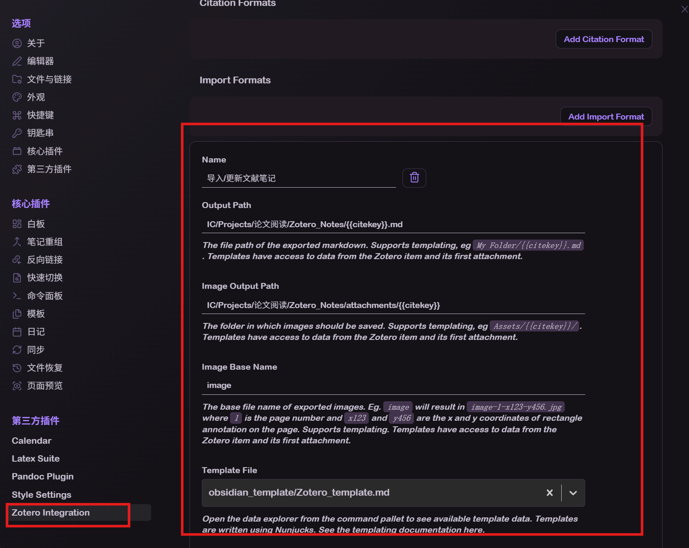

当前推荐配置如下：

```json
{
  "database": "Zotero",
  "noteImportFolder": "IC/Projects/论文阅读/Zotero_Notes",
  "pdfExportImageDPI": 180,
  "pdfExportImageFormat": "png",
  "pdfExportImageQuality": 90,
  "citeFormats": [],
  "exportFormats": [
    {
      "name": "导入/更新文献笔记",
      "outputPathTemplate": "IC/Projects/论文阅读/Zotero_Notes/{{citekey}}.md",
      "imageOutputPathTemplate": "IC/Projects/论文阅读/Zotero_Notes/attachments/{{citekey}}",
      "imageBaseNameTemplate": "image",
      "templatePath": "obsidian_template/Zotero_template.md"
    }
  ],
  "citeSuggestTemplate": "[[{{citekey}}]]",
  "openNoteAfterImport": true,
  "whichNotesToOpenAfterImport": "first-imported-note",
  "exeVersion": "1.0.15",
  "_exeInternalVersion": 1
}
```

### 6.1 PDF Utility

Zotero Integration 需要一个 PDF Utility 来提取 PDF 批注。
点击红框位置安装，如果装好了，会出现红框内的内容
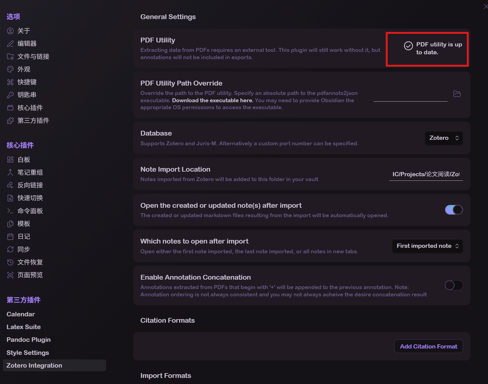


如果插件自动下载失败，可以让codex直接帮你安装，参照[15. 懒人快速配置](#15-懒人快速配置)，也可以手动下载：

```text
https://github.com/mgmeyers/pdfannots2json/releases/download/1.0.15/pdfannots2json.Windows.x64.zip
```

解压后把：

```text
pdfannots2json.exe
```

放到插件目录：

```text
.obsidian/plugins/obsidian-zotero-desktop-connector/
```

验证方式是在命令行运行：

```powershell
pdfannots2json.exe -v
```

正常输出：

```text
v1.0.15
```

---

## 7. 文献笔记模板

模板文件路径：

```text
obsidian_template/Zotero_template.md
```

模板内容如下：

```nunjucks
---
cssclasses:
  - zotero-note
status: todo
weight: 1
field:
date: "{{ date | format("YYYY-MM") }}"
DOI: "{{ DOI }}"
tags:
  - 文献笔记
  - 论文阅读




  - {{ cleanTag }}



zotero_tags: "{{ allTags }}"
authors: "{{ t.firstName }} {{ t.lastName }}{{ t.name }}, "
期刊简称: "{{ journalAbbreviation }}"
languages: "{{ language }}"
类别: "{{ itemType }} {{ thesisType }}"
期刊: "{{ publicationTitle }} {{ university }}"
---

## {{ title }}

## 文献信息

| 字段 | 内容 |
| --- | --- |
| 标题 | {{ title }} |
| 作者 | {{ t.firstName }} {{ t.lastName }}{{ t.name }},  |
| 年份 | {{ date | format("YYYY") }} |
| DOI | {{ DOI }} |
| Zotero 标签 | {{ allTags }} |
| 期刊/会议 | {{ publicationTitle }} {{ university }} |
| 类型 | {{ itemType }} {{ thesisType }} |
| Call Number | {{ callNumber }} |
| PDF | {{ pdfLink }} |
| Zotero | {{ pdfZoteroLink }} |
| URL | [Open online]({{ url }}) |

## 摘要

{{ abstractNote }}_Zotero 中暂无摘要。_

## 我的笔记





## 批注

<mark style="background-color: {{ color }}">Highlight</mark>NoteImageInk





### Imported: {{ importDate | format("YYYY-MM-DD HH:mm") }}



{{ annotationLabel(each.type, each.color) }} 第 {{ each.page }} 页 [jump to](zotero://open-pdf/library/items/{{ each.attachment.itemKey }}?page={{ each.page }}&annotation={{ each.id }})

> {{ each.annotatedText }}

标注：{{ each.comment }}

![[{{ each.imageBaseName }}]]





```

---

## 8. 隐藏同步标记的 CSS

模板中使用了：

```nunjucks

```

导出后，Obsidian 文件里会出现：

```markdown
%% begin research_v1 %%
%% end research_v1 %%
```

这是 Zotero Integration 用来保护内容的同步标记。它可以避免下次更新时覆盖“我的笔记”。

为了不影响阅读，可以用 CSS 隐藏这些标记。

CSS snippet 文件：

```text
.obsidian/snippets/zotero-note-hide-sync-comments.css
```

内容如下：

```css
/* Hide Zotero Integration persist markers in notes using cssclass: zotero-note. */
.markdown-preview-view.zotero-note .comment,
.markdown-reading-view.zotero-note .comment,
.markdown-source-view.mod-cm6.zotero-note .cm-line:has(.cm-comment),
.markdown-source-view.mod-cm6 .cm-contentContainer:has(.cm-hmd-frontmatter.cm-atom) .cm-line:has(.cm-comment) {
  display: none !important;
}
```

启用方式：

```text
Obsidian -> 设置 -> 外观 -> CSS 代码片段 -> 打开 zotero-note-hide-sync-comments
```

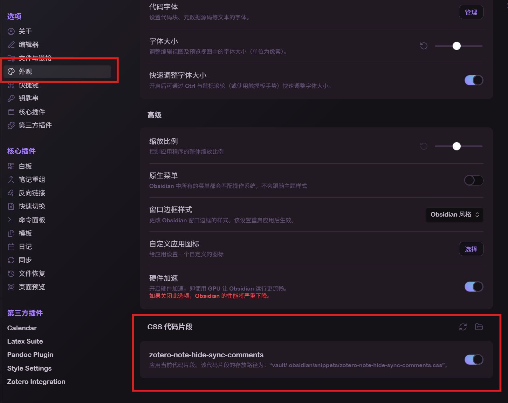

注意：如果在源码模式中查看，仍然可能看到原始 Markdown 标记，这是正常的，在预览模式下，如果还有，可以重启obsidian试一下。

---

## 9. 日常使用流程

### 9.1 第一次导入一篇文献

1. 打开 Zotero。
2. 找到目标文献，确认 PDF 附件和元数据正常。
3. 打开 Obsidian。
4. 按 `Ctrl + P` 打开命令面板。
5. 搜索：

```text
导入/更新文献笔记
```

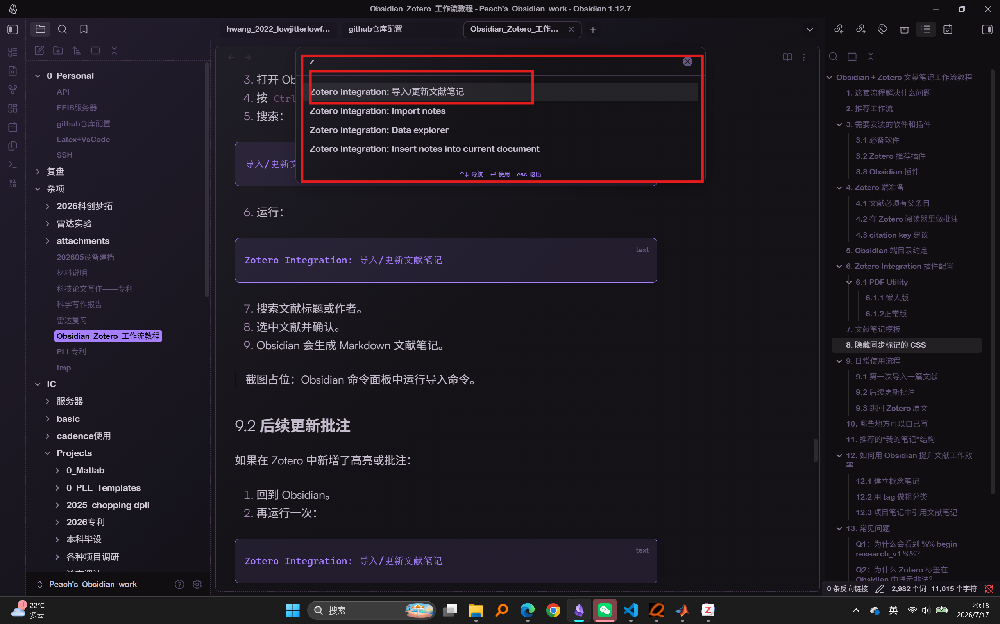
6. 运行：

```text
Zotero Integration: 导入/更新文献笔记
```

7. 搜索文献标题或作者。
8. 选中文献并确认。

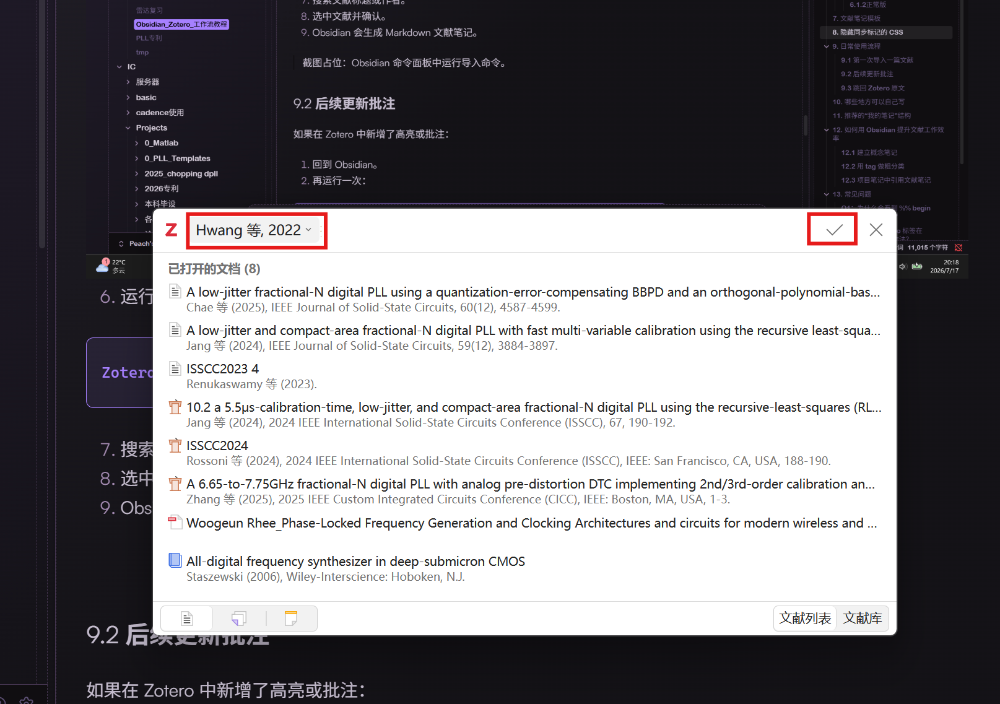

9. Obsidian 会生成 Markdown 文献笔记。

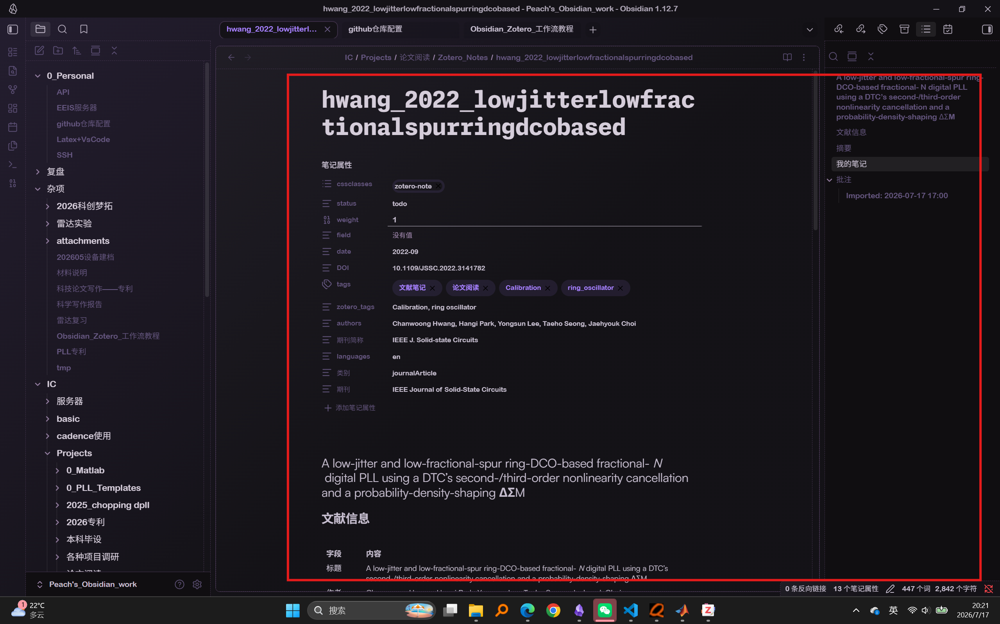

### 9.2 后续更新批注

如果在 Zotero 中新增了高亮或批注：

1. 回到 Obsidian。
2. 再运行一次：

```text
Zotero Integration: 导入/更新文献笔记
```

3. 选择同一篇文献。
4. 新批注会追加到“批注”区域。

“我的笔记”区域会保留。

### 9.3 跳回 Zotero 原文

导入的批注中会有类似链接：

```markdown
[jump to](zotero://open-pdf/library/items/xxx?page=11&annotation=xxx)
```

点击后可以回到 Zotero PDF 阅读器中的对应页面和批注位置。

---

## 10. 哪些地方可以自己写

推荐自己写在：

```markdown
## 我的笔记
```

这个区域受 `persist` 保护，后续更新不会被覆盖。

不推荐手动修改：

- YAML 属性区
- 文献信息表格
- 摘要
- 批注自动导入区

这些区域由 Zotero 和模板生成，后续重新导入时可能被重刷。

---

<a id="sec-11-notes-structure"></a>

## 11. 推荐的“我的笔记”结构

可以使用下面的结构消化重要论文：

```markdown
### 总结
这篇论文解决什么问题？核心贡献是什么？

### 背景
为什么这个问题重要？前人的方法有什么不足？

### 方法
用了什么结构、算法、校准、建模？

### 关键公式/图
哪些公式、图、表值得以后复用？

### 对我的启发
能不能用于自己的项目？例如 ADPLL、DTC、DSM、Calibration 等。

### 存疑
哪里没讲清楚？哪里可能有坑？

### 可引用句子
以后写报告、论文、组会时可能用到的表达。
```

例子：

```markdown
### 一句话总结
这篇文章用 PDS ΔΣM 和 DTC 二/三阶非线性抵消来降低 fractional spur 和 jitter。

### 对我的启发
PDS-M 的核心不是噪声整形，而是改变 QE 的概率分布，使 DTC 非线性后的平均误差不随时间周期变化。可以和 [[DTC INL]]、[[Fractional Spur]]、[[ChoppingPLL_pro]] 关联。

### 存疑
三阶校准的单独贡献没有展示，只能看到整体校准结果。
```

---

## 12. 如何用 Obsidian 提升文献工作效率

### 12.1 建立概念笔记

不要只保存一篇篇论文。建议把常见概念单独建笔记：

```text
DTC INL.md
Fractional Spur.md
PDS DSM.md
DCD-RLS.md
BBPD.md
TDC Quantization.md
```

然后在文献笔记中链接：

```markdown
相关概念：[[DTC INL]] [[Fractional Spur]] [[PDS DSM]]
相关项目：[[cxmt_ADPLL]] [[ChoppingPLL_pro]]
```

这样后续不是按“论文”回忆，而是按“问题/方法/项目”组织知识。

### 12.2 用 tag 做粗分类

模板会自动从 Zotero 标签生成合法 Obsidian tag，例如：

```yaml
tags:
  - 文献笔记
  - 论文阅读
  - Calibration
  - ring_oscillator
```

建议 Zotero 标签不要太长，尽量使用简洁英文或中文关键词。

### 12.3 项目笔记中引用文献笔记

在项目笔记中可以这样写：

```markdown
## 相关文献

- [[hwang2022lowjitter]]：PDS-M + DTC nonlinear cancellation
- [[dcd_rls_xxx]]：多变量校准算法
```

这样论文和项目能互相连接。

---

## 13. 常见问题

<a id="faq-q1"></a>

### Q1：为什么会看到 `%% begin research_v1 %%`？

这是 Zotero Integration 的保留区标记，用来避免重新导入时覆盖“我的笔记”。

正常情况下可以用 CSS snippet 隐藏。不要手动删除。

<a id="faq-q2"></a>

### Q2：为什么 Zotero 标签在 Obsidian 中提示非法？

Obsidian tag 不允许空格、逗号等字符。模板会把 Zotero 标签清洗成合法 tag，例如：

```text
Calibration, ring oscillator
```

变成：

```yaml
- Calibration
- ring_oscillator
```

同时原始标签保存在：

```yaml
zotero_tags: "Calibration, ring oscillator"
```

<a id="faq-q3"></a>

### Q3：为什么文件名连在一起？

文件名来自 Better BibTeX 的 citation key。如果想要下划线，需要在 Zotero 的 Better BibTeX 设置中修改 citation key 格式。

<a id="faq-q4"></a>

### Q4：我能不能直接改文献信息表格？

可以临时改，但不推荐。重新导入时可能被模板重刷。自己的内容建议写在“我的笔记”。

<a id="faq-q5"></a>

### Q5：Zotero 新增批注后 Obsidian 会自动更新吗？

不会。需要手动运行：

```text
Zotero Integration: 导入/更新文献笔记
```

<a id="faq-q6"></a>

### Q6：PDF Utility 下载失败怎么办？

手动下载 `pdfannots2json.Windows.x64.zip`，解压后把 `pdfannots2json.exe` 放到 Zotero Integration 插件目录。

---

## 14. 组内推荐规范

建议组内统一：

```text
文献笔记目录：IC/Projects/论文阅读/Zotero_Notes/
图片附件目录：IC/Projects/论文阅读/Zotero_Notes/attachments/
模板文件：obsidian_template/Zotero_template.md
```

建议每篇重要论文至少写：

```markdown
### 一句话总结
### 方法
### 对我的启发
### 存疑
```

不要求每篇论文都精读，但重要论文不要只导入批注，至少要有自己的二次总结。

---

## 15. 懒人快速配置

配置文件已放在 `config/` 目录下，点击即可下载。
obsidian的设置可以使用图形化界面，也可使用代码文档完成配置，对于初次使用obsidian或者不熟练的人，可以直接将配置文件发给codex/claude code，告诉它你的obsidian工作路径，它可以直接帮你下载好插件，完成配置，直接上手使用

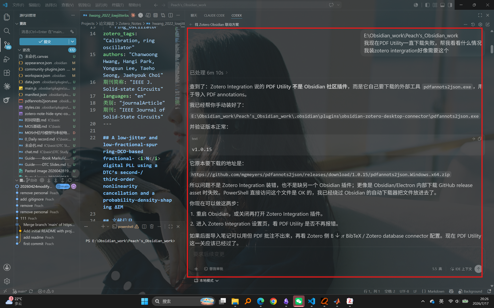

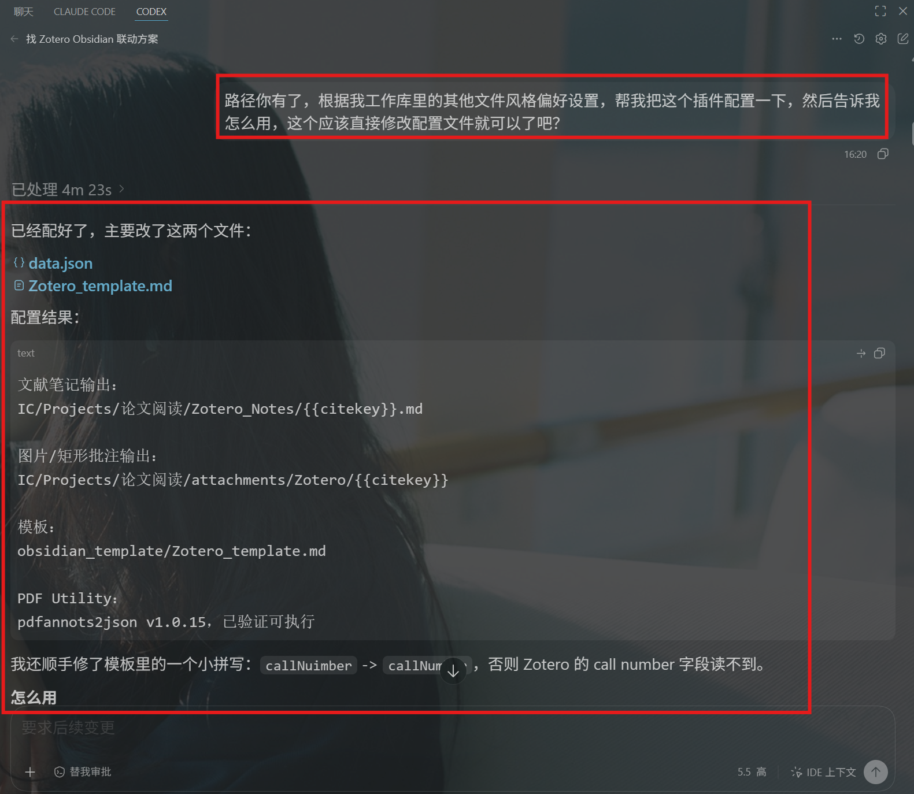

---

## 16. 笔记备份

建议定期备份 Obsidian 笔记。这里推荐把 GitHub 当作个人云盘使用，配合 VS Code 做简单的版本管理。这样既可以防止误删，也能回退历史版本。

本节主要备份三类内容：

```text
1. 文献笔记 Markdown
2. Zotero 批注导出的图片附件
3. Obsidian/Zotero Integration 的模板和配置
```

### 16.1 必须备份哪些文件

对于本教程这套工作流，至少建议备份下面这些内容：

```text
IC/Projects/论文阅读/Zotero_Notes/
obsidian_template/Zotero_template.md
.obsidian/snippets/zotero-note-hide-sync-comments.css
.obsidian/plugins/obsidian-zotero-desktop-connector/data.json
```

其中，文献笔记和图片附件都在：

```text
IC/Projects/论文阅读/Zotero_Notes/
```

文献笔记示例：

```text
IC/Projects/论文阅读/Zotero_Notes/hwang_2022_lowjitterlowfractionalspurringdcobased.md
```

Zotero 批注图片附件示例：

```text
IC/Projects/论文阅读/Zotero_Notes/attachments/hwang_2022_lowjitterlowfractionalspurringdcobased/
```

注意：如果只备份 `.md` 文件，不备份 `attachments/`，那么 Obsidian 里的图片批注会丢失。

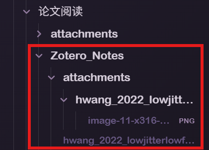

### 16.2 不建议备份哪些文件

通常不建议把 Zotero 的完整 PDF 数据库直接放进 Obsidian 仓库：

```text
E:/Zotero_paper_data/storage/
```

原因是 PDF 文件通常比较大，GitHub 普通仓库不适合长期存大量 PDF。Zotero 自己可以使用 Zotero Sync、WebDAV、NAS 或硬盘同步工具备份 PDF。

Obsidian 这边重点备份“读后的结果”：

```text
文献笔记
批注图片
模板
插件配置
```

### 16.3 在 GitHub 上创建空仓库

1. 打开 GitHub。
2. 点击 New repository。
3. 输入仓库名，例如：

```text
Peach-Obsidian-Notes
```

4. 不要勾选：

```text
Add a README file
Add .gitignore
Choose a license
```

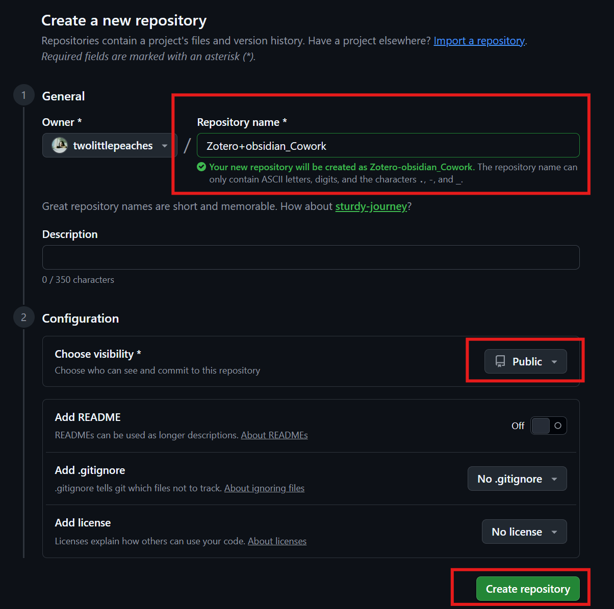

5. 可以根据个人意愿，选择公开/私有，创建空仓库。
6. 在仓库页面选择 SSH，复制以 `git@github.com:` 开头的地址。

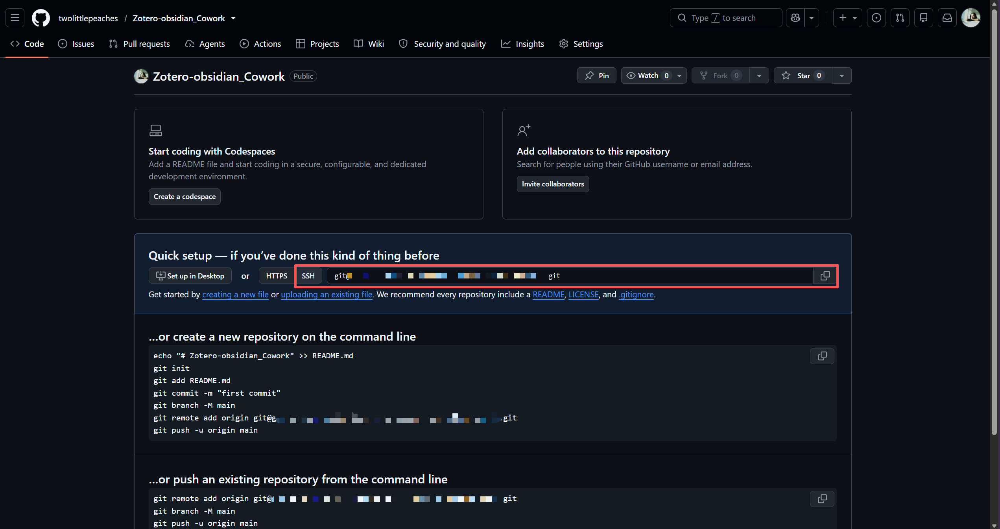

### 16.4 在 VS Code 中初始化仓库

1. 用 VS Code 打开 Obsidian vault 根目录。
2. 点击左侧“源代码管理”图标。
3. 点击“初始化仓库”或 `Initialize Repository`。

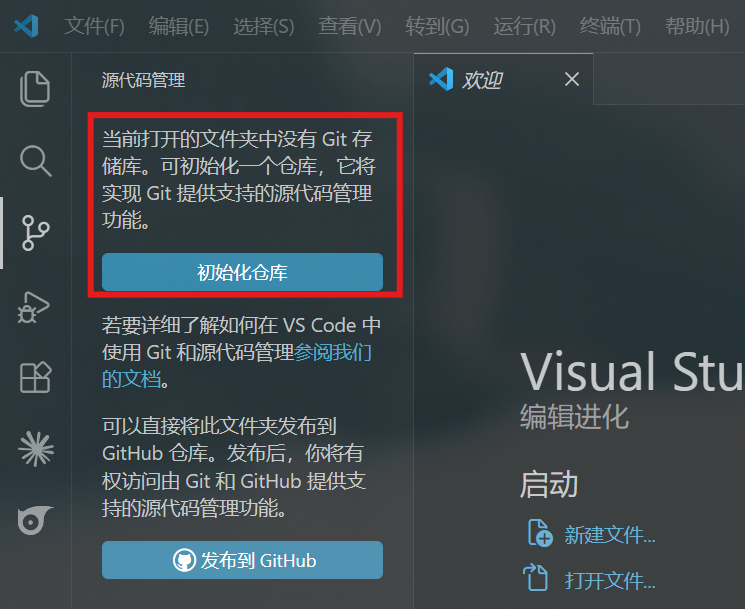

初始化完成后，VS Code 会开始显示当前 vault 中的文件变化。

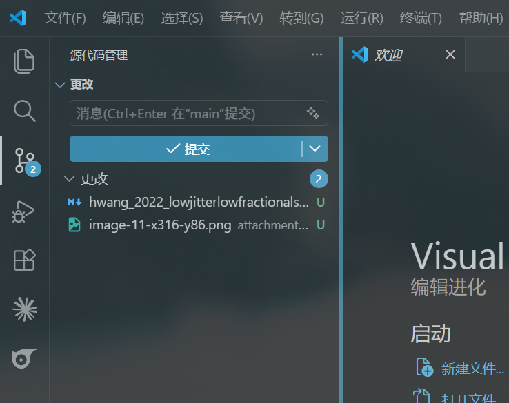

### 16.5 关联 GitHub 远程仓库

1. 按 `Ctrl + Shift + P` 打开命令面板。
2. 输入：

```text
Git: Add Remote
```

3. 粘贴刚才复制的 SSH 地址（强烈建议使用SSH而非HTTPS，否则可能会因为代理问题导致上传失败，git开头即为SSH，https开头则为HTTPS），例如：

```text
git@github.com:username/Peach-Obsidian-Notes.git
```

4. 远程名称填写：

```text
origin
```

可以用下面命令确认是否关联成功：

```bash
git remote -v
```

如果输出类似下面这样，说明正确：

```text
origin  git@github.com:username/xxx.git (fetch)
origin  git@github.com:username/xxx.git (push)
```

### 16.6 添加 `.gitignore`

建议在 vault 根目录添加 `.gitignore`，避免把大体积/明显不需要同步的内容推到 GitHub。

一个保守示例：

```gitignore
# Personal folders if needed
0_Personal/

# Obsidian runtime/cache-like files
.obsidian/workspace.json
.obsidian/workspace-mobile.json

# OS files
.DS_Store
Thumbs.db

# LaTeX temporary files
*.aux
*.log
*.out
*.synctex.gz
*.toc
*.fls
*.fdb_latexmk
build/
```

注意：如果希望复用 Zotero Integration 配置，不要忽略下面这些文件：

```text
.obsidian/plugins/obsidian-zotero-desktop-connector/data.json
obsidian_template/Zotero_template.md
.obsidian/snippets/zotero-note-hide-sync-comments.css
```

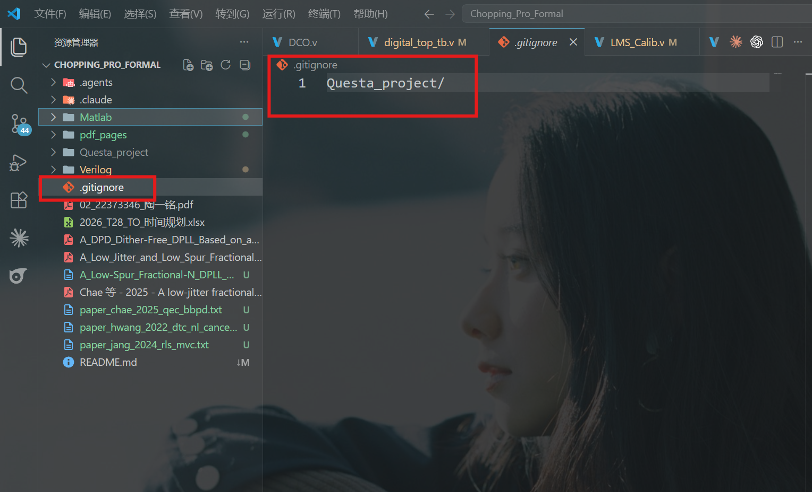

### 16.7 提交和推送

每次完成一轮笔记整理后，可以做一次提交：

1. 在 VS Code 源代码管理面板中查看改动。
2. 点击 `+` 暂存需要提交的文件。
3. 输入提交信息（**第一行，必须填写！！！**），例如：

```text
first commit/update zotero notes workflow tutorial
```

4. 点击 Commit/提交。
5. 点击同步更改，可看到下方“图表”处已同步

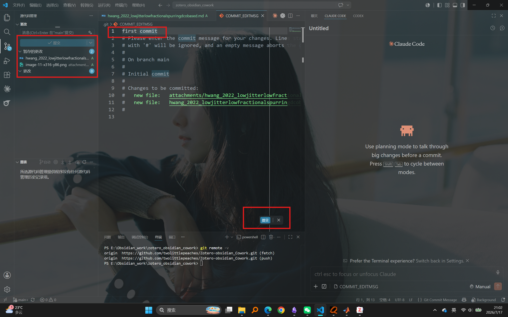

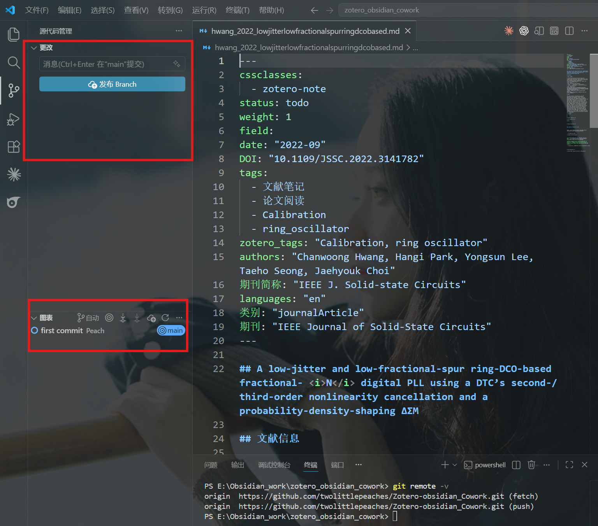

每次本地文件更新，上面的方框都会检测到，再次暂存、提交即可。

github页面变成下面这样，即为上传成功

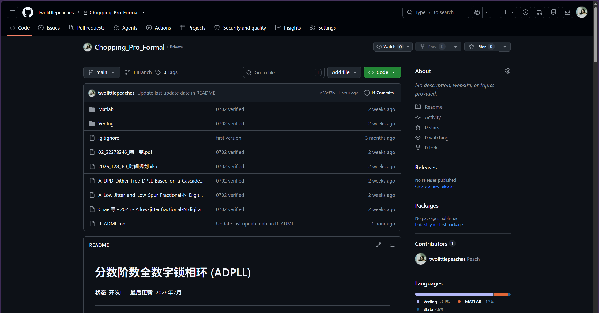

### 16.8 推荐备份习惯

建议形成下面的习惯：

```text
每次集中读完几篇论文 -> 更新 Obsidian 文献笔记 -> commit -> push
```

提交信息可以简单写：

```text
add hwang 2022 pll note
update zotero integration tutorial
add dtc inl reading notes
```

重要原则：

- 文献笔记 `.md` 要备份。
- `Zotero_Notes/attachments/` 要备份，否则批注图片会丢。
- 模板和 CSS snippet 要备份，否则换电脑后样式和同步保留区可能不一致。
- Zotero 原始 PDF 数据库建议单独备份，不建议全部塞进 Obsidian Git 仓库。

**更多git使用方法，可自行上网查阅/codex**

---

## 17. 附带配置文件

仓库里已经放好了这几份可直接下载的文件：

- [Zotero Integration 配置](config/data.json)
- [文献模板](config/Zotero_template.md)
- [CSS snippet](config/zotero-note-hide-sync-comments.css)

如果你的 Obsidian 库路径不同，下载后优先修改 `config/data.json` 里的这些字段：

```text
noteImportFolder
outputPathTemplate
imageOutputPathTemplate
templatePath
```

教程截图都在：

```text
attachments/
```

GitHub 上直接打开这个目录就能看到图片。
